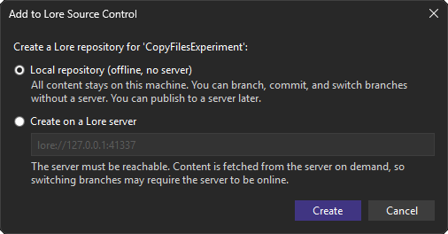
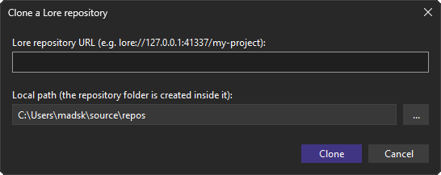
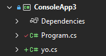
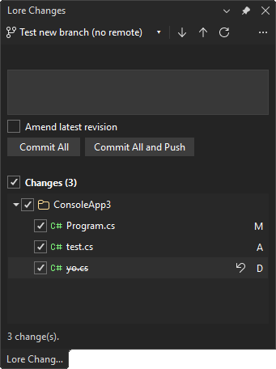

[marketplace]: <https://marketplace.visualstudio.com/items?itemName=MadsKristensen.LoreVS>
[vsixgallery]: <https://www.vsixgallery.com/extension/LoreVS.4beb5277-15de-4fff-bcaa-82af106d7233>
[repo]: <https://github.com/madskristensen/LoreVS>

# Lore for Visual Studio

[][vsixgallery]

Download this extension from the [Visual Studio Marketplace][marketplace]
or get the latest CI build from [Open VSIX Gallery][vsixgallery].

----------------------------------------------

Bring [Lore](https://github.com/EpicGames/lore) source control directly into
Visual Studio. Onboard a solution or folder, see file status at a glance, and
commit - all without leaving the IDE or dropping to a terminal.

## Add a solution to Lore

Right-click the solution node (or the Open Folder root) and choose
**Lore > Add to Lore Source Control**. Choose **Local repository** (the default)
to create a fully offline repository where all content stays on your machine, so
you can branch, commit, and switch branches without a server. Choose **Create on
a Lore server** and enter a server URL (e.g. `lore://127.0.0.1:41337`) only when
you want to bind a remote so you can push. Lore binds the loaded projects to the
provider; the `.lore` folder records the binding so it is restored automatically
the next time you open the solution.

## Clone an existing repository

Right-click the solution node and choose **Lore > Clone Lore Repository...**.
Paste a repository URL (e.g. `lore://127.0.0.1:41337/my-project`) and pick a
local folder; Lore checks the server is reachable, clones the working tree, and
records the remote in `.lore` so push and pull work immediately.

## See status at a glance

Once a solution is controlled, Visual Studio shows Lore status glyphs next to
files in Solution Explorer. Saving a document refreshes its glyph automatically,
and you can force a refresh any time with the **Refresh** button in the Lore
Changes window.

Right-click a file under **Lore** for **Undo Changes** (revert edits to the
committed version), **Compare with Unmodified** (diff against the committed
version), and **Ignore and Untrack Item** (adds it to `.loreignore`).

## Review and commit in the Lore Changes window

Choose **Lore > Commit to Lore...** to open a dedicated panel, similar to the built-in Git
Changes window.

The window shows the current branch with incoming/outgoing
indicators and arranges every changed file in a folder tree back to the
repository root, each file showing a status badge (M, A, D, R, C) on the right.
Renamed or moved files show an **R** badge, and hovering it reveals the path the
file was moved from.
From here you can:

- Pick exactly which files to include in the next commit. Every changed file
  has a checkbox (checked by default) and each folder has a tri-state checkbox
  that selects or clears all the files beneath it; the header checkbox toggles
  everything at once. Your selection is remembered across automatic refreshes
  while you compose the commit.
- Write a commit message and **Commit All**, or **Commit All and Push** in one
  step. When you exclude some files the buttons update to show how many are
  selected (for example **Commit 2** / **Commit 2 and Push**) and only those
  files are committed. Tick **Amend latest revision** to fold the selected
  changes into the previous revision instead.
- Expand or collapse folders, and double-click a file (or right-click >
  **Open Diff**) to compare the working
  copy against the committed version in the native Visual Studio diff viewer.
- Right-click a file and choose **Discard Changes...** to reset it to the last
  committed state.
- Use the toolbar to **Pull** (sync the latest remote revisions), **Push**
  committed revisions, or **Refresh** the change list.

## Work with branches

Click the branch button (showing the current branch name) on the Lore Changes
toolbar to open the branch picker. From there you can:

- Switch to any other local branch (the current branch is marked and disabled).
- Choose **New Branch...** to open the create-branch dialog. Enter a name, see
  the branch you are basing it on (Lore always branches from the current
  revision), and choose whether to check out the new branch. Leave **Checkout
  branch** unchecked to create the branch without leaving your current one.
- Choose **Merge Branch into Current...** and pick a branch to fold it into the
  branch you are on. When the merge has conflicts, Visual Studio's built-in 3-way
  merge tool opens for each conflicted file (current, incoming, and base). Resolve
  and accept each one and Lore commits the merge automatically; close the merge
  tool without accepting to abort and restore the working tree.

Switching and merging are offline-first: when the target branch's content is
already cached locally they complete without a network round trip. Lore's local
store is an LRU cache, so content can be evicted; if a switch or merge needs
content that is no longer cached, it is fetched from the Lore server. When that
content is missing and the server is unreachable, the operation reports a clear
message asking you to start (or reconnect to) your Lore server and try again.

## Settings

Configure everything under **Tools > Options > Lore**:

| Setting | Description |
| ------- | ----------- |
| Identity | Commit identity (e.g. `you@example.com`). |
| Push after commit | Automatically push every successful commit. |
| Server port (gRPC/QUIC) | gRPC/QUIC port used to build repository URLs. Default `41337`. |

## Get involved

Found a bug? Have an idea? Head to the [issue tracker][repo] - pull
requests are always welcome.
